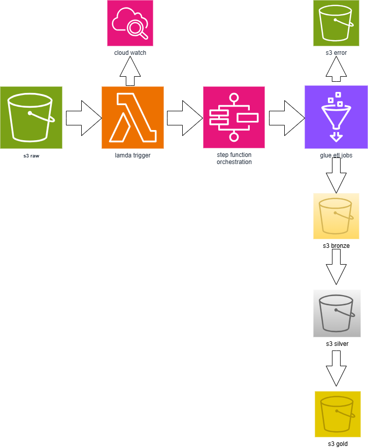
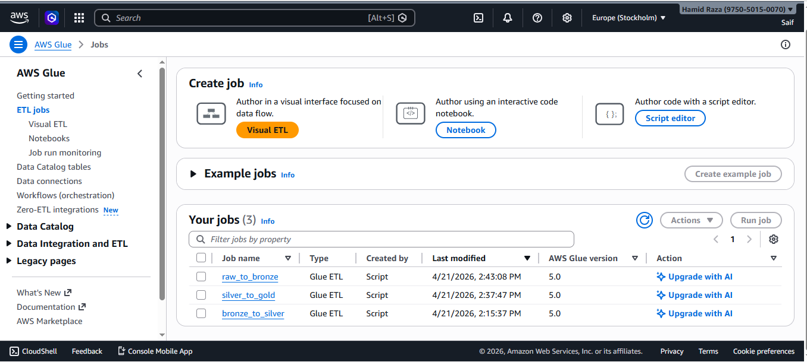
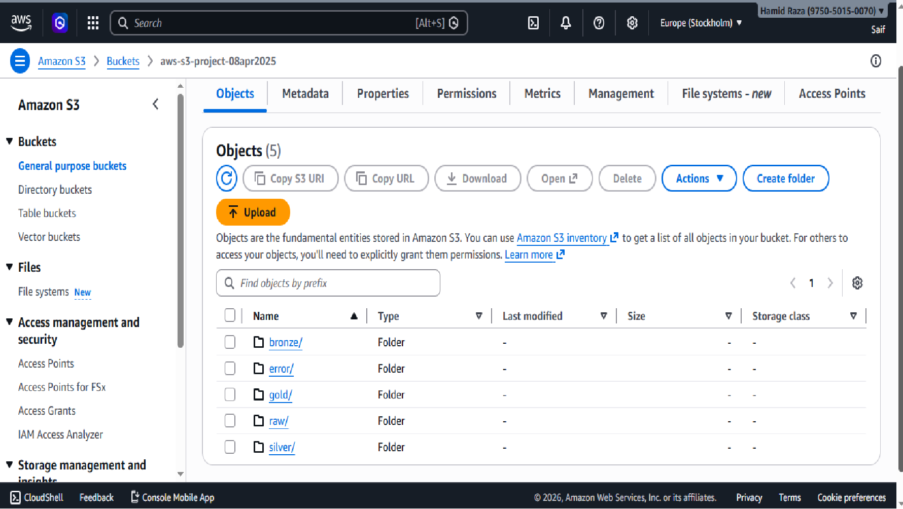

# End-to-End AWS Data Engineering Pipeline

End-to-end AWS ETL pipeline using S3, Lambda, Step Functions, and Glue with medallion architecture.

---

##  Project Overview
This project demonstrates a data engineering pipeline built on AWS.  
Raw e-commerce data is ingested, cleaned, transformed, and stored in analytics-ready format.

---

##  Architecture

---

# Data Flow

S3 (Raw) → Lambda → Step Functions → Glue → S3 (Bronze → Silver → Gold)

---

## ☁️ AWS Services Used

- Amazon S3  
- AWS Lambda  
- AWS Step Functions  
- AWS Glue  
- Amazon CloudWatch  

---

##  Data Processing

- Raw → Bronze: Cleaning   
- Bronze → Silver: Joins and transformations  
- Silver → Gold: Aggregations  

---

##  Partitioning

Data stored as:
s3://bucket/gold/year=2026/month=01/

---

##  Error Handling

- Bad records → stored in S3 error bucket  
- Logs monitored using CloudWatch  

---

##  Screenshots

### Step Functions Workflow

### Glue Job Execution

### S3 Buckets Structure

---

##  Project Structure

project/
│
├── README.md
├── architecture.png/
├── screenshots/
├── datasets/
├── glue_jobs/
└── lambda/

---

## 🚀 Skills gained

- Built ETL pipeline using AWS  
- Learned PySpark transformations  
- Implemented data lake architecture  
- Used CloudWatch for monitoring  
